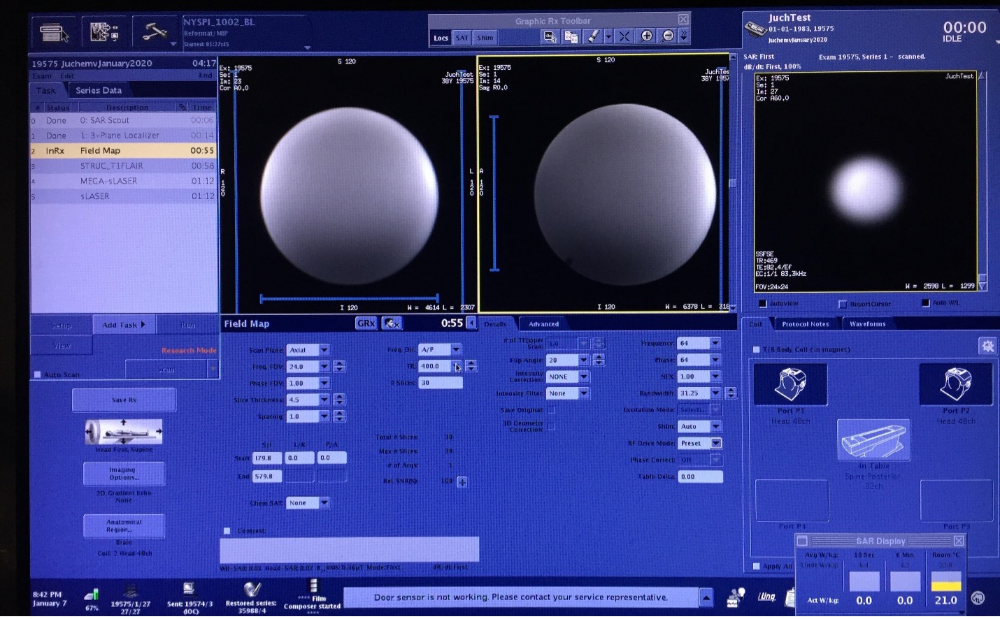

# b0detox-ge-scripts
## *Open source field mapping on GE platforms*
## Summary
The MR SCIENCE Laboratory has made our fieldmapping sequence needed for B0Detox on GE platforms truly open source. As such users are encouraged to expand and modify the code as they are interested. This sequence is heavily based on the original GE fieldmapping sequence but critical modifications enable it to be used in conjunction with B0Detox to provide full 3D shimming for scanners with up to 3rd order capabilities. The full B0Detox package can be downloaded at: https://inventions.techventures.columbia.edu/technologies/cu17326_b0detox

## Installation
Download the version of B0map from the GE collaborate website (https://collaborate.mr.gehealthcare.com/login.jspa?referer=%252Findex.jspa).

Once logged in go to Downloads -> I accept -> EPIC SDK. Open the PSD source code for your specific scanner and software version. Download the B0map.tgz and unpack the folder. Inside the folder edit B0map.e and cut and paste the code snippet found below into the beginning of cvinit, this should be roughly at line 614 but this exact line number will change depending on software version. Note that you need to use the B0map.e associated with your software version.

You must also have the script “getShimAll” in the appropriate directory. For our system this was /usr/g/research/columbia/cj/. You must either create this exact directory and place the attached script “getShimAll” in there, or you must change the path in both the below code snippet and in the script getShimAll. Specifically lines 29 to 33 must be changed in getShimAll to your new directory, as well as the two references to /usr/g/research/columbia/cj/ in the beginning of the code snippet. All this code snippet does is writes the 2nd order shim currents to variables which are saved in the Dicom headers, this is a necessary but minor modification to the GE fieldmapping sequence. Once these steps are completed compile your B0mape sequence and transfer the binaries to the scanner. You can then load the sequence in as you would a normal GE B0map sequence, specifically it must be loaded into a 2D Gradient Echo Sequence -> GRE. Ensure that the Scan Plane is axial prior to loading in the binaries. Once they are loaded in change the parameters to the following:



Most importantly ensure that the stack of slices is centered about [0,0,0] as B0DETOX does not accommodate spatial shifts. You can change the FOV as you wish to include regions you are interested in. Once this has been completed the core functionalities are identical to the GE field mapping sequence. A warning, the employed system call makes the sequence a bit slow.


## B0map modifications
Inside the folder edit **B0map.e** and cut and paste the code snippet found below into the beginning of cvinit, this should be roughly at line 614 but this exact line number will change depending on software version

```
/* start Karl Landheer portion */
 system("/usr/g/research/columbia/cj/getShimAll");

/* below line placed in Karl Landheer */
   FILE *fp = fopen("/usr/g/research/columbia/cj/tempShimFileAll.txt", "r");
   if (fp == 0) {
        return FAILURE;
   }
   char mystring [1000];
   int karlShim[8];
   int i; int j;
   // int karltempint;
   char *sptr = NULL;
   j = 0; i = -1;
   int t;
  /* int negativeValue; */

   for (t = 0; t < 5; t++) {
        if ( fgets (mystring, 1000 , fp) != NULL)
                puts (mystring);
        /* fprintf(fw, "%s\n", mystring); */
        for (j = 0; j < 1000; j++) {
                if ((mystring[j] == 'w') && (mystring[j+1] == 'r') && (mystring[j+2] == 'i') && (mystring[j+3] == ' ')) {
                        sptr = mystring+j+4;
                        /* fprintf(fw, "%s\n", sptr); */
                        sscanf(sptr,"%d", &karlShim[t]);
                        /* fprintf(fw, "%d\n", karltempint); */
                        /* karlShim[t] = karltempint; */
                        break;
                }
        }

      /*
        for (j = 0; j < 1; j++) {
                karlShim[j] = 0;

                fprintf(fw, "%s\n", mystring);
                 i++;
                negativeValue = 0;
                while (mystring[i] != ' ') {
                if (mystring[i] == '-')
                        negativeValue = 1;
                else
                        karlShim[j] = karlShim[j] *10 + (mystring[i] - '0');
                        i++;
                }
                if (negativeValue == 1)
                        karlShim[j] = -1*karlShim[j];

        } */
        }
        cvmod(opuser16,-9999,9999,0, "karl shim",0, " ");
        cvmod(opuser14,-9999,9999,0, "karl shim",0, " ");
        cvmod(opuser19,-9999,9999,0, "karl shim",0, " ");
        cvmod(opuser20,-9999,9999,0, "karl shim",0, " ");
        cvmod(opuser21,-9999,9999,0, "karl shim",0, " ");

        opuser16 = karlShim[0];
        opuser14 = karlShim[1];
        opuser19 = karlShim[2];
        opuser20 = karlShim[3];
        opuser21 = karlShim[4];

       /* fclose(fw); */
        fclose(fp);
   /* end KL portion */
```

## Contact
Any questions and concerns please email cwj2112@columbia.edu
